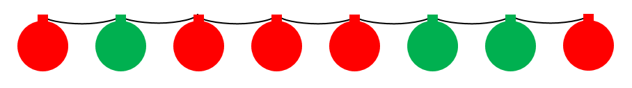

# 방울
문제 설명
호진이는 빨간색 방울과 초록색 방울로 구성된 트리 장식을 가지고 있습니다. 이 방울들은 한 줄로 연결되어 있는데, 호진이는 이중 일부를 잘라 트리를 장식하려 합니다. 호진이는 균형을 좋아해서, 장식에 사용하는 빨간색 방울과 초록색 방울의 개수를 동일하게 사용하려 합니다.

예를 들어, 아래 그림과 같이 트리 장식이 주어졌을 때, 호진이는 두 번째 방울과 세 번째 방울 사이를 잘라 나온 (빨간색, 초록색) 방울을 트리에 장식할 수 있습니다.

호진이는 장식의 길이를 가장 길게 잘라 트리를 꾸미려고 합니다. 예를 들어, 위의 그림에서 첫 번째 방울과 두 번째 방울 사이를 자르고, 일곱 번째 방울과 여덟 번째 방울 사이를 자르면 (초록색, 빨간색, 빨간색, 빨간색, 초록색, 초록색)으로, 길이가 6인 장식을 얻을 수 있습니다.

방울의 색을 담은 배열 bell이 매개변수로 주어집니다. 빨간색 방울과 초록색 방울의 개수가 같게 자른 장식 길이의 최댓값을 return 하도록 solution 함수를 작성해주세요.

제한사항
1 ≤ bell의 길이 ≤ 1,000,000
1 ≤ bell[i] ≤ 2
bell[i] = 1은 빨간색 장식을, bell[i] = 2는 초록색 장식을 의미합니다.
입출력 예

입출력 예
bell	result
[1, 2, 1, 1, 1, 2, 2, 1]	6
[1, 1, 1, 1, 1, 1]	0
[2, 2, 1, 1, 2, 2, 2, 2, 2, 2, 1]	4
입출력 예 설명
입출력 예 #1

본문에서 설명한 예시입니다.
입출력 예 #2

빨간색 방울과 초록색 방울의 수가 같도록 장식을 자를 수 없습니다.
입출력 예 #3

첫 번째부터 네 번째 방울을 사용하면, 빨간색 방울과 초록색 방울의 수가 같도록 트리를 장식할 수 있으며, 이때 길이가 최댓값이 됩니다.