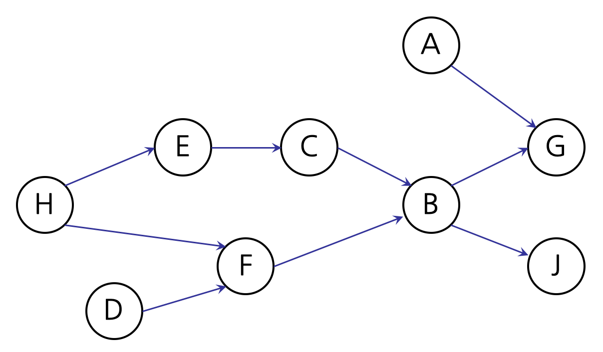

# 선후수 수강
문제 설명
선후수 수강 (레벨 3)

윤서는 자신이 수강하고자 하는 과목을 신청하기 위해서 수강편람을 읽었고, 어느 과목을 수강하기 위해서는 그 이전에 이미 수강했어야 하는 과목들이 정해져 있음을 알았습니다. 예를 들어 과목 "A" 를 수강하기 위해서는 그에 앞서 과목 "B" 를 수강해야 한다면 과목 "B" 를 과목 "A" 의 선수과목이라고 부릅니다.

윤서가 특정한 과목 "Z" 를 수강신청하기 위해서는 이 과목의 선수과목인 "Y" 를 먼저 이수해야 하며, 과목 "Y" 에도 선수과목 "X" 가 지정되어 있다면 과목 "X" 를 이수한 후에야 과목 "Y" 를 수강신청하여 이수할 수 있습니다.

윤서가 수강하고자 하는 과목을 정했을 때, 이 과목을 수강하기 위해서는 적어도 어떤 과목들을 어떤 순서에 따라 수강해야 하는지를 알아내는 함수 solution() 을 완성하세요.

함수 solution() 의 입력으로는 다음과 같은 것들이 주어집니다.

선후수 관계를 나타내는 배열 s1 과 s2: 배열 s1 의 i 번째 원소가 "X" 이고 배열 s2 의 i 번째 원소가 "Y" 인 경우, 과목 "X" 가 과목 "Y" 의 선수과목임을 나타냅니다.
윤서가 수강하고자 하는 과목 코드 k
함수 solution() 은 k 에 의하여 주어진 코드를 가지는 과목을 이수하기 위하여 순서대로 이수해야 하는 과목들의 코드를 나열한 배열 answer 를 반환합니다.

제한사항
수강편람에 기재된 과목의 수는 8 이상 10,000 이하입니다.
선후수 관계를 나타내는 배열 s1 과 s2 의 길이는 서로 같으며, 9 이상 100,000 이하입니다.
각 과목에는 수강 코드가 부여되어 있으며, 수강 코드는 10 글자 이내의 영문 알파벳 대문자로 이루어져 있습니다.
어떠한 과목 "X" 와 "Y" 사이에도 순환적 선후수 관계는 주어지지 않습니다. 즉, 과목 "X" 를 수강하기 위하여 과목 "Y" 를 먼저 이수해야 하는데 과목 "Y" 의 선수과목 관계를 따라가 보았을 때 이 과목을 수강하기 위해서는 과목 "X" 를 우선 이수했어야 하는 경우는 없습니다.
서로 선후수 관계가 없는 과목 "M" 과 "K" 를 이수하는 순서는 과목 코드의 알파벳 순서에 따른다고 가정합니다.
입출력 예
s1	s2	k	answer
["A", "E", "B", "D", "B", "H", "F", "H", "C"]	["G", "C", "G", "F", "J", "E", "B", "F", "B"]	"B"	["D", "H", "E", "C", "F", "B"]
["A", "E", "B", "D", "B", "H", "F", "H", "C"]	["G", "C", "G", "F", "J", "E", "B", "F", "B"]	"G"	["A", "D", "H", "E", "C", "F", "B", "G"]
입출력 예 설명
입출력 예 #1
알파벳 대문자 한 글자씩으로 코드가 매겨진 과목이 아홉 개 있습니다. 이 과목들의 선후수 관계를 그림으로 나타내 보면 다음과 같습니다.

윤서가 수강하고자 하는 과목 코드 k 는 "B" 입니다. 과목 "B" 를 수강신청하기 위해서는 과목 "C" 와 과목 "F" 를 선수과목으로 이수해야 하는데, 과목 "C" 의 선수과목은 "E" 가 있으며 또다시 과목 "E" 의 선수과목으로는 과목 "H" 가 있습니다. 과목 "F" 의 선수과목은 과목 "D" 와 과목 "H" 입니다.

윤서는 가장 먼저 과목 "H" 또는 과목 "D" 중 하나를 이수해야 합니다. 그러고 나서야 다른 과목들을 수강신청하여 이수할 수 있습니다. 이 두 과목 중에서는 과목 "D" 가 알파벳 순서 상으로 앞서는 코드를 가지고 있기 때문에 과목 "D" 를 가장 먼저 이수합니다. 그 후에 과목 "H" 까지 이수함으로써 이제 수강신청할 수 있는 과목들은 과목 "E" 와 과목 "F" 입니다. 이 두 과목 중에서는 알파벳 순서에서 앞서는 코드를 가진 과목 "E" 를 우선 이수합니다.

그 후에는 과목 "C" 와 과목 "F" 중 하나를 수강신청할 수 있습니다. 이 때에도 과목 코드의 알파벳 순서에 따라 과목 "C" 를 먼저 신청하여 이수하고 나서 과목 "F" 를 이수합니다. 그러고 나면 이제 과목 "B" 를 신청할 수 있으므로 해당 과목을 신청하여 이수합니다.

이 때까지의 과정을 이수하는 과목의 순서에 따라 나열하면 ["D", "H", "E", "C", "F", "B"] 의 배열이 얻어지므로, 이것을 반환합니다.

입출력 예 #2
수강편람에 기재된 과목들은 앞서 예시한 경우와 같습니다. 단, 이번에는 윤서가 수강하고자 하는 과목이 과목 "G" 인 경우입니다. 이 과목을 수강하기 위해서는 과목 "A" 와 과목 "B" 를 먼저 이수해야 합니다. 과목 코드의 알파벳 순서가 앞서는 과목 "A" 를 가장 먼저 이수하고, 그 후에 과목 "B" 를 이수하기 위해서는 위의 입출력 예 #1 에서와 같은 흐름을 따릅니다. 그리고 마지막에 과목 "G" 를 수강신청하므로, 반환할 배열은 ["A", "D", "H", "E", "C", "F", "B", "G"] 입니다.